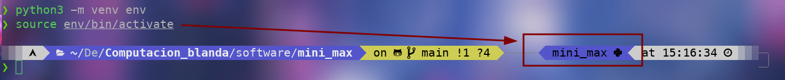
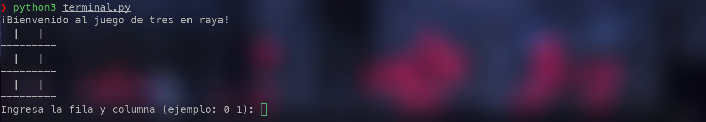
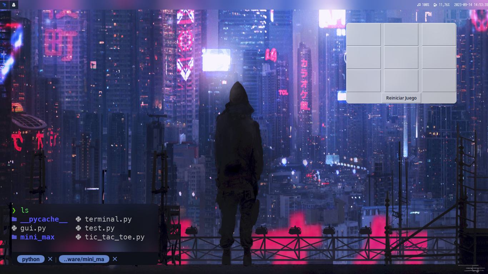

# ¿Como correcterlo?

### Entorno virtual

Para hacer un entorno para correr el software se ha de crear
un entorno virtual. Para eso solo se requiere usar un par de
comandos en una terminal:

```bash
python3 -m venv env
```

Para iniciar el entorno se usar `source`

```bash
source env/bin/active
```

Ahora ya debería salir el entorno como `env`, ahora ya se puede
instalar `requirements.txt`



```bash
pip install -r ./requirements.txt
```

Esto instalará tk, por lo que probablemente sea útil revisar [este
recurso](https://stackoverflow.com/questions/48504746/importerror-libtk8-6-so-cannot-open-shared-object-file-no-such-file-or-direct).

Para usar el software se puede usar python3 con 2 opciones posibles

```bash
python3 terminal.py
```



Ejecutará el juego de tic tac toe desde una terminal sencilla

```bash
python3 gui.py
```



Ejecutará el juego con TK en una pequeña terminal como se ve en la imagen
